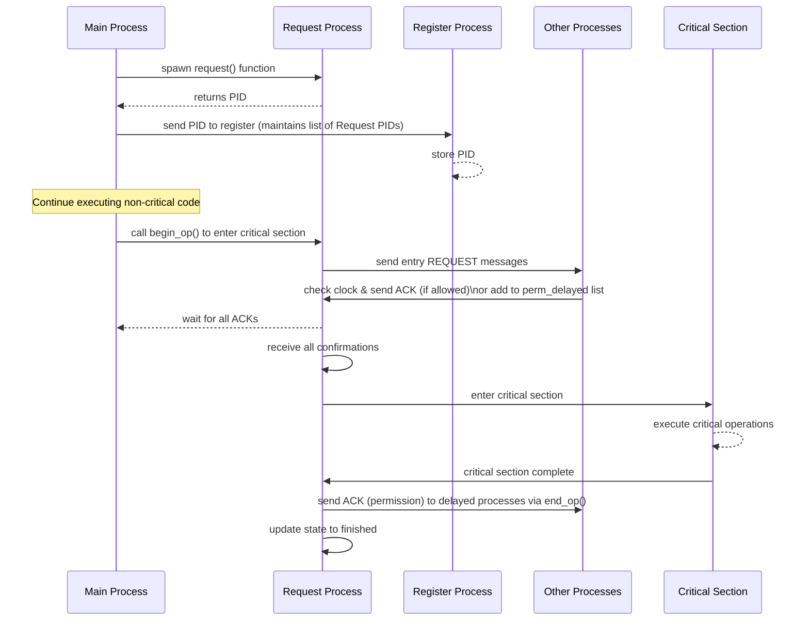

# DistributedAccessControl
A distributed synchronization system implementing the Readers-Writers problem using the Ricart-Agrawala algorithm in Elixir. Designed to ensure efficient and scalable mutual exclusion without a central coordinator.

## Overview
This project implements a distributed synchronization system for managing concurrent access to a shared resource, specifically addressing the **Readers-Writers** problem. The solution leverages the **Ricart-Agrawala** algorithm, extended to support multiple operation types, ensuring a fair and efficient execution without a central coordinator.

## Features
- Implements the **generalized Ricart-Agrawala algorithm** for distributed mutual exclusion.
- Supports concurrent readers while ensuring exclusive access for writers.
- Uses **Lamport timestamps** to maintain proper request ordering.
- Built with **Elixir**, leveraging its concurrency model for efficient process communication.

## How It Works

    
When a process starts, it immediately spawns a dedicated request function. This function is responsible for handling incoming requests from other processes while also managing the process's clock and state. This design simplifies clock management by reducing the number of message exchanges.

The spawned process returns its PID, which is then sent to a separate register process. This register (running on a different server) maintains a list of all active request process PIDs.

The main process continues executing code that doesn't require mutual exclusion. When it needs to enter the critical section, it calls the begin_op function. This pre-protocol call instructs its associated request process to change state and sends a message to the other processes (specifically, their request processes) to request entry into the critical section.

Each process checks its clock (CLK) to decide if it can enter the critical section immediately or if it must wait. If waiting is necessary, the process is added to a perm_delayed list. When the process currently in the critical section finishes, it sends an acknowledgment (ACK) to every process in the perm_delayed list.

Once all confirmations are received, the process enters the critical section. Upon exiting, it calls the end_op() function, which updates its state and notifies the other processes that it has finished.

## Requirements
- [Elixir](https://elixir-lang.org/) installed.
- Basic understanding of distributed systems and process synchronization.
